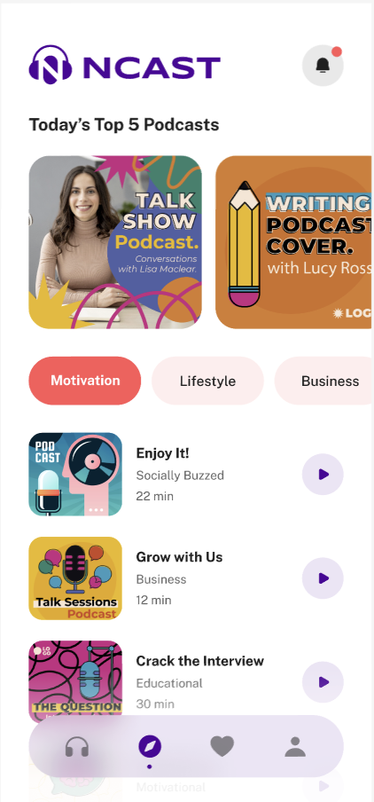
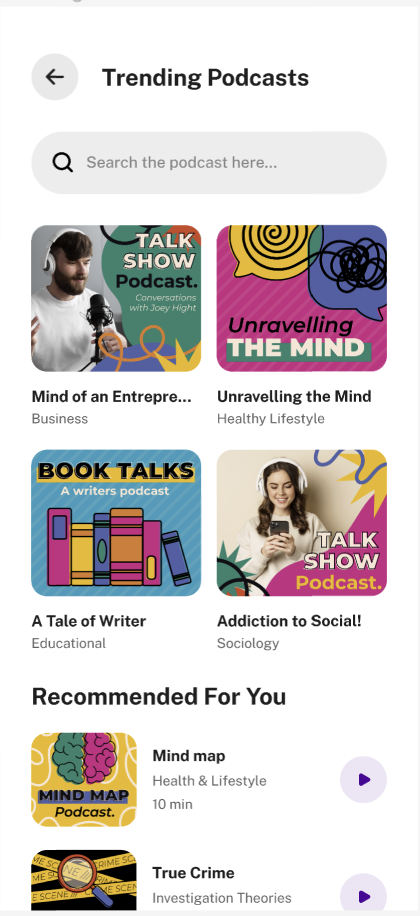

# ncast

A new Flutter project.

## Getting Started

This project is a starting point for a Flutter application.

This project demonstrates the complete UI of the ncast application

## To Run the Project

Below code will generate the asset files in your lib/gen/assets.gen.dart

```
dart run build_runner build
```

Below code will generate localised texts from the arb file.

```
flutter gen-l10n
```

## _Features_

-  -  -  -  -  -  -  -  -  - 
